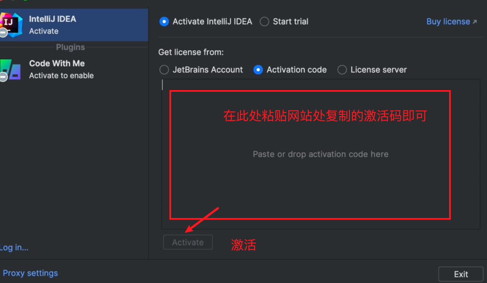
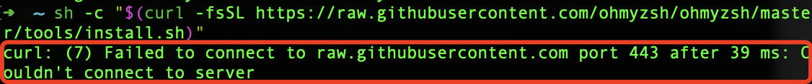
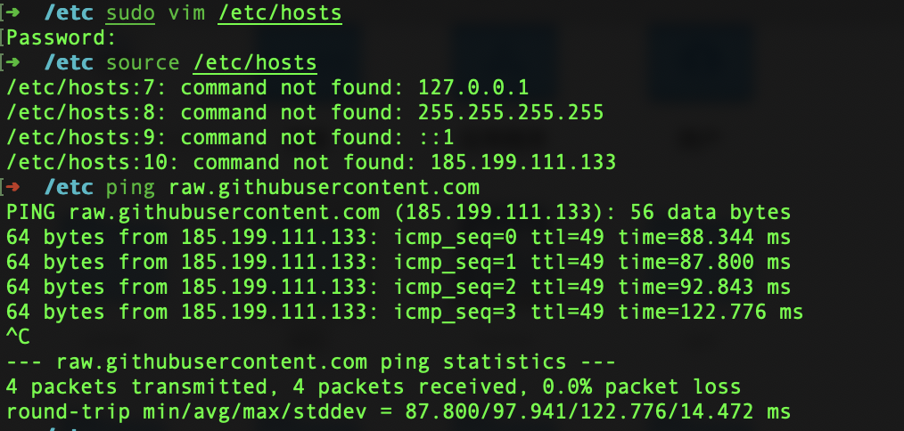
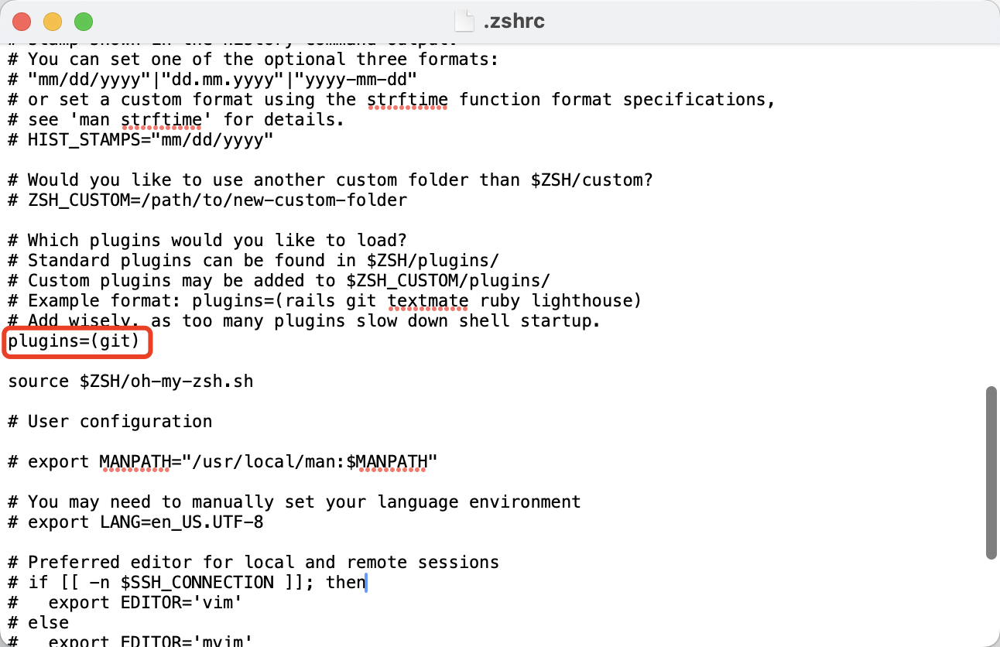
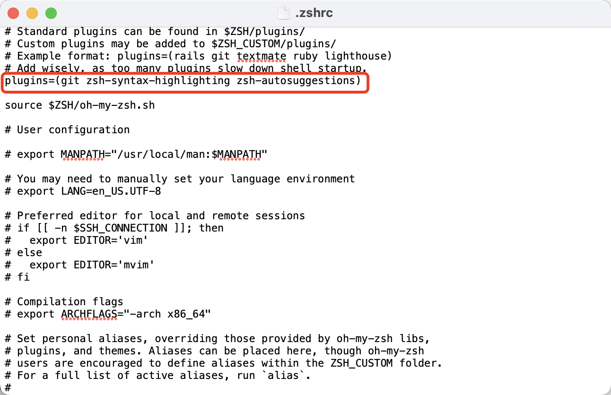
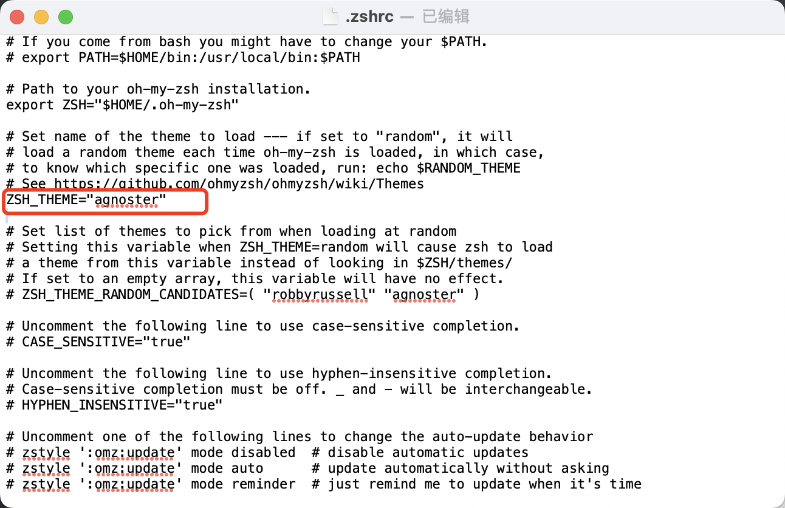
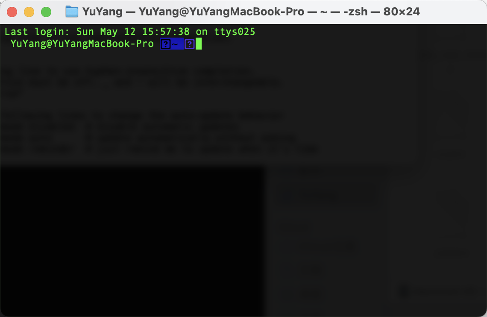
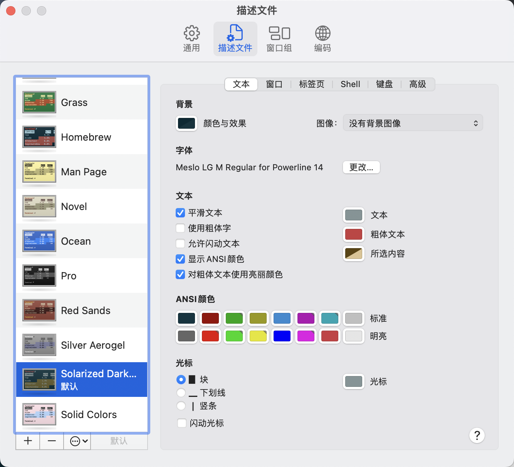

# 一些配置记录

## 01	Navicat for MAC

> 链接: https://pan.baidu.com/s/1cIcSkwdRb4VZwP3I8oXL3Q 
>
> 提取码: nw7d 
>
> 包含：
>
> - Navicat 16.3.2 for mac
> - Navicat 16.3.4 for Mac
> - Navicat Premium 16.2.9
> - Navicat_Premium_16_3_4
> - Navicat_Premium_16_3_4(保存密码需要关闭SIP)

## 02	Idea、Pycharm破解

- 步骤一：先去官网下载专业版

  

- 步骤二：先按要求安装到需要激活步退出


- 步骤三：进去下面👇网站 选择一个能进的链接进去 下载jetbra.zip 粘贴破解码


> 地址：https://3.jetbra.in

- 步骤四：终端进去jetbra下的scripts目录运行

```
./install.sh
```



## 03	Oh My Zsh 下载安装配置

> 官网地址：https://ohmyz.sh

原始安装指令（墙外）：

```
sh -c "$(curl -fsSL https://raw.githubusercontent.com/ohmyzsh/ohmyzsh/master/tools/install.sh)"
```

报错



解决方法：

- 打开网站: `https://www.ipaddress.com/`查询一下 `raw.githubusercontent.com`对应的IP 地址
- 找到 /etc 目录下 的 hosts 文件，复制出来 修改，在后面添加 如下：然后用修改的文件替换 /etc 目录下的 hosts 文件



以及安装plugin： zsh-syntax-highlight zsh-autosuggestions

插件这里我只推荐两个（语法高亮、自动提示，git是默认的）
·自动提示插件**[zsh-autosuggestions](https://links.jianshu.com/go?to=https%3A%2F%2Fgithub.com%2Fzsh-users%2Fzsh-autosuggestions)**
使用以下命令安装
`git clone https://github.com/zsh-users/zsh-autosuggestions ${ZSH_CUSTOM:-~/.oh-my-zsh/custom}/plugins/zsh-autosuggestions`
·语法高亮**[zsh-syntax-highlighting](https://links.jianshu.com/go?to=https%3A%2F%2Fgithub.com%2Fzsh-users%2Fzsh-syntax-highlighting)**使用以下命令安装
`git clone https://github.com/zsh-users/zsh-syntax-highlighting.git ${ZSH_CUSTOM:-~/.oh-my-zsh/custom}/plugins/zsh-syntax-highlighting`





修改主题：



报错：



报错原因：字体异常

解决方法：下载字体：

```
\# clone

git clone https://github.com/powerline/fonts.git

\# install

cd fonts

./install.sh

\# clean-up a bit

cd ..

rm -rf fonts
```

打开terminal的偏好设置-描述文件，点击 文本标签下的 字体的“更改”，课按照如下选择字体：


下载solarized

git clone https://github.com/altercation/solarized.git

打开终端 -> 偏好设置 -> 描述文件 -> 导入文件，导入 `solarized/osx-terminal.app-colors-solarized/Solarized Dark ansi.terminal`，设置通用下的默认描述文件为`Solarized Dark ansi`。


